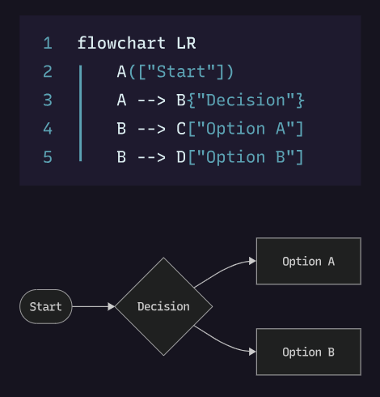

<h1 align="center"><b>Mermaid</b></h1>
<h1 align="center"><b>Diagramming and charting tool</b></h1>

<div align="center">
    
</div>

# Table of contents
- [1. Quick start](#1-quick-start)
- [2. Big picture](#2-big-picture)
- [3. How it works (intuitive)](#3-how-it-works-intuitive)
- [4. Real-world examples for AI/Data/EdTech](#4-real-world-examples-for-aidataedtech)
- [5. Minimal syntax you’ll actually use](#5-minimal-syntax-youll-actually-use)
- [6. Essential usage patterns](#6-essential-usage-patterns)
- [7. Go to the examples](#7-go-to-the-examples)
- [8. Key takeaways](#8-key-takeaways)
- [9. Best links (only what you need)](#9-best-links-only-what-you-need)
- [10. Repo contents](#10-repo-contents)

# 1. Quick start
- Open the Live Editor: `https://mermaid.live` (paste any snippet and export PNG/SVG).
- In Cursor, install extensions for a smooth workflow:
  - Markdown Preview Mermaid Support (publisher: bierner)
  - Mermaid Markdown Syntax Highlighting (publisher: bpruitt-goddard)
- In any `.md` file, add a ```mermaid fence and open Markdown Preview (to the side) to see diagrams render.

# 2. Big picture
Mermaid is a text-to-diagram tool. You write concise plain text; it renders flowcharts, sequence diagrams, Gantt charts, ER diagrams, and more. It matters because you can keep diagrams versioned in Git, review them in PRs, automate generation in CI, and embed them in Markdown (GitHub, docs, wikis) with almost zero friction.

# 3. How it works (intuitive)
- **You write Markdown code fences** with the `mermaid` language.
- **A renderer** (GitHub, VS Code/Cursor preview, or mermaid.live/CLI) parses the text and draws the diagram.
- **Edit text → diagram updates** instantly; no drag-and-drop or binary diagram files.

# 4. Real-world examples for AI/Data/EdTech
See `examples/` for copy-pasteable snippets:
- **Simple**: Flowchart and sequence basics.
- **Medium**: LLM request flow and data pipeline.
- **Advanced**: Model lifecycle state machine, feature-store ERD, and AI project Gantt.

# 5. Minimal syntax you’ll actually use
- **Flowchart**: `flowchart TD` or `LR` for direction; `A --> B` edges.
- **Sequence**: `sequenceDiagram`; `participant`; `A->>B: message`.
- **Gantt**: `gantt`; `section`; tasks with dates or offsets.
- **State**: `stateDiagram-v2`; `[*] --> State`.
- **ER**: `erDiagram`; entities with fields; relationships like `||--o{`.

# 6. Essential usage patterns
- **Subgraphs** group steps; **links** and **clicks** add interactivity.
- **Styling**: use `classDef` and `class` or `style` to highlight.
- Keep styles minimal early on; clarity beats decoration.

# 7. Go to the examples
- Start at `examples/simple.md` (5 minutes)
- Then `examples/medium.md`
- Finally skim `examples/advanced.md` when you need it

# 8. Key takeaways
| Concept | Use | Pros | Cons |
|---|---|---|---|
| Text-to-diagram | Describe systems and workflows in text | Versionable, fast, embeds in docs | Complex layouts can need tuning |
| Flowcharts | Process logic, data flow | Easiest to learn, highly readable | Can get busy without grouping |
| Sequence diagrams | Call flows, request/response | Great for API/LLM chains | Long messages can clutter |
| State diagrams | Lifecycle modeling | Clear invariants and transitions | Needs discipline to stay accurate |
| Gantt | Project planning | Lightweight roadmaps in docs | Not a full PM tool |
| ER diagrams | Data modeling | Useful for schema reviews | Simplified vs. DB-specific tools |

# 9. Best links (only what you need)
- Mermaid Docs: `https://mermaid.js.org/`
- Live Editor: `https://mermaid.live`
- GitHub Repo: `https://github.com/mermaid-js/mermaid`
- Mermaid CLI (export images): `https://github.com/mermaid-js/mermaid-cli`

# 10. Repo contents
- `README.md`: This practical tutorial
- `examples/`: Simple, Medium, Advanced diagrams with notes
