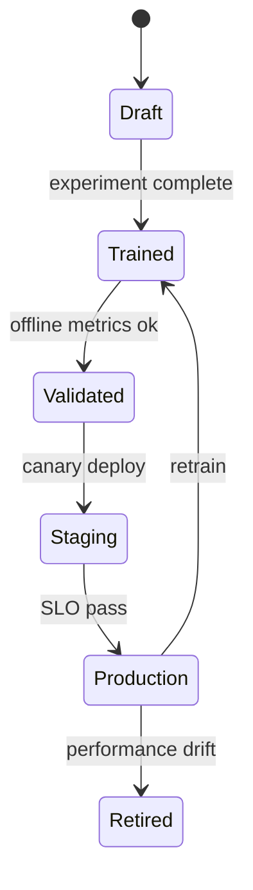
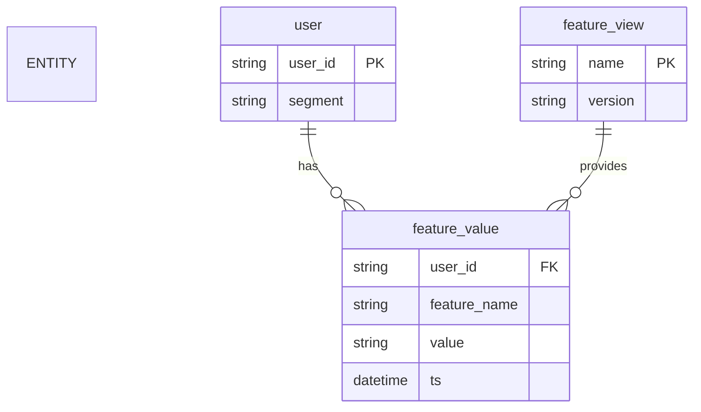
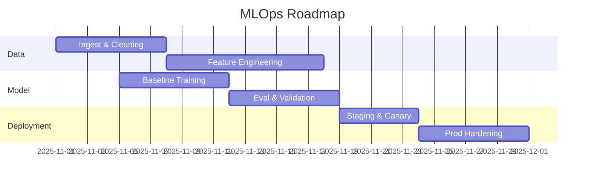

<h1 align="center"><b>Advanced Mermaid Examples</b></h1>

# 1. Model Lifecycle (State Machine)

```mermaid
stateDiagram-v2
  [*] --> Draft
  Draft --> Trained: experiment complete
  Trained --> Validated: offline metrics ok
  Validated --> Staging: canary deploy
  Staging --> Production: SLO pass
  Production --> Retired: performance drift
  Production --> Trained: retrain
```

# 2. Feature Store ER Diagram (Sketch)

```mermaid
erDiagram
  ENTITY user {
    string user_id PK
    string segment
  }
  ENTITY feature_view {
    string name PK
    string version
  }
  ENTITY feature_value {
    string user_id FK
    string feature_name
    string value
    datetime ts
  }
  user ||--o{ feature_value : has
  feature_view ||--o{ feature_value : provides
```

# 3. AI Project Gantt (Roadmap)

```mermaid
gantt
  dateFormat  YYYY-MM-DD
  title  MLOps Roadmap
  section Data
  Ingest & Cleaning      :a1, 2025-11-01, 7d
  Feature Engineering    :a2, after a1, 10d
  section Model
  Baseline Training      :b1, 2025-11-05, 7d
  Eval & Validation      :b2, after b1, 7d
  section Deployment
  Staging & Canary       :c1, after b2, 5d
  Prod Hardening         :c2, after c1, 7d
```

