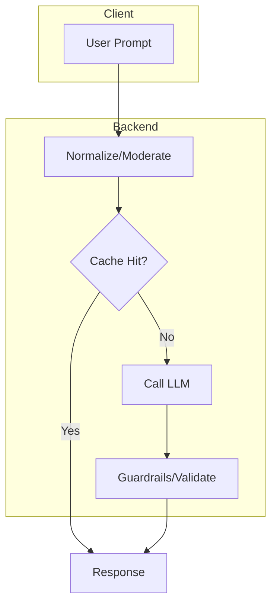
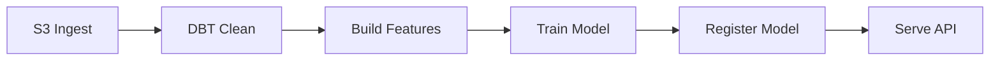

<h1 align="center"><b>Medium Mermaid Examples</b></h1>

# 1. LLM Request Flow with Caching & Guardrails

```mermaid
flowchart TD
  subgraph Client
    A[User Prompt]
  end

  subgraph Backend
    B[Normalize/Moderate]
    C{Cache Hit?}
    D[Call LLM]
    E[Guardrails/Validate]
  end

  A --> B --> C
  C -- Yes --> R[Return Cached]
  C -- No --> D --> E --> R[Response]
```

# 2. Data Pipeline Sketch

```mermaid
flowchart LR
  S3[S3 Ingest] --> CLEAN[DBT Clean]
  CLEAN --> FEAT[Build Features]
  FEAT --> TRAIN[Train Model]
  TRAIN --> REG[Register Model]
  REG --> SERVE[Serve API]
```

