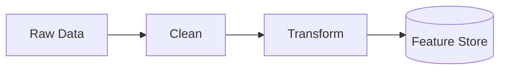
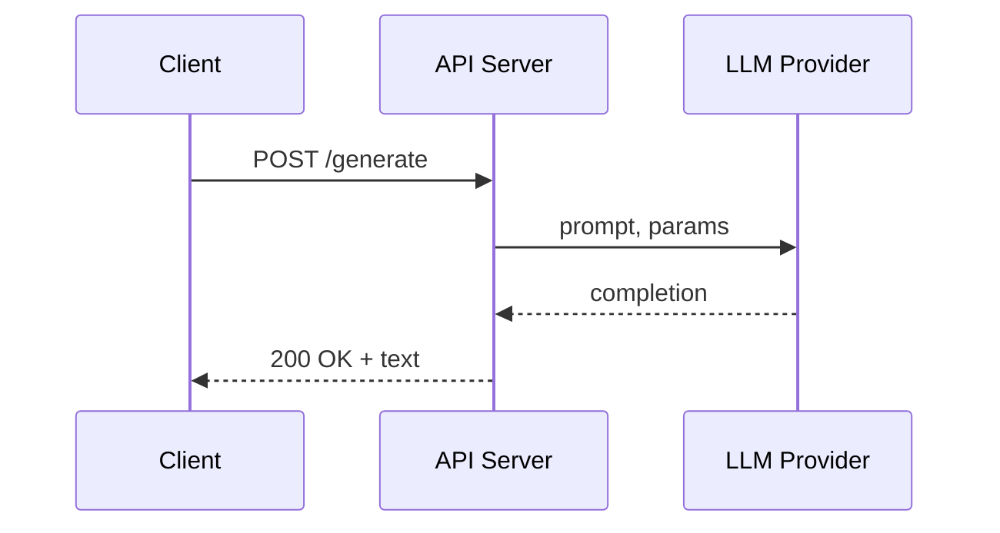

<h1 align="center"><b>Simple Mermaid Examples</b></h1>

# 1. Flowchart: Minimal ETL

```mermaid
flowchart LR
  A[Raw Data] --> B[Clean]
  B --> C[Transform]
  C --> D[(Feature Store)]
```

# 2. Sequence: API → LLM

```mermaid
sequenceDiagram
  participant C as Client
  participant S as API Server
  participant L as LLM Provider
  C->>S: POST /generate
  S->>L: prompt, params
  L-->>S: completion
  S-->>C: 200 OK + text
```

